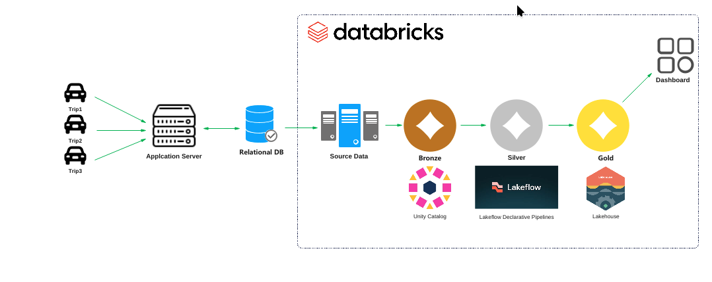

# goodcabs-data-engineering-modernization
Transforming GoodCabs' Regional Data Analytics through Databricks Lakehouse and Declarative Spark Pipelines

## Problem Statement

**Company:** GoodCabs (Fast-growing Cab Service Company)

**Key Challenges:**
- Delayed regional data delivery
- Generic, hard-to-use dashboards
- Manual data export and reworking
- Slow innovation
- Procedural Spark pipelines with manual orchestration
- Tightly coupled data processing systems

## Solution Approach

### Technology Stack
- **Platform:** Databricks
- **Data Processing:** Lakehouse Architecture
- **Pipeline Approach:** Declarative Spark Pipelines (LakeFlow)

### Key Improvements
- Declarative data intent specification
- Automated execution plan optimization
- Efficient dependency management
- Scalable incremental processing
- Faster regional data insights

## Project Objectives

1. **Operational Efficiency**
- Reduce data delivery time
- Create region-specific, actionable dashboards
- Minimize manual data manipulation

2. **Technical Modernization**
- Move from procedural to declarative data pipelines
- Enhance data platform flexibility
- Enable rapid adaptation to regional needs

## Architecture

## Datasets
[1. data](https://github.com/sarfarazalamgit/goodcabs-data-engineering-modernization/tree/main/1.%20data)

## Codes
[2. codes](https://github.com/sarfarazalamgit/goodcabs-data-engineering-modernization/tree/main/2.%20codes)
